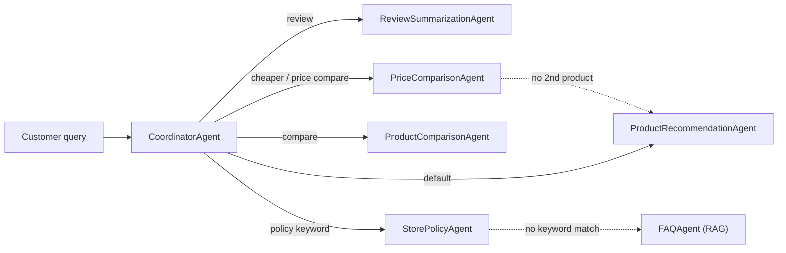

# Pickr AI

An AI shopping assistant that answers product, review, and store-policy questions — a coordinator routes each query to a specialized agent, rather than one do-everything prompt.

## Architecture



Guardrails (prompt-injection, off-topic, moderation, hallucination checks) wrap every routed call, and conversation history persists to RDS MySQL so follow-ups resolve correctly. The reasoning behind each of these choices — including the two fallback chains above — is in [`DECISIONS.md`](DECISIONS.md).

## Run it (demo)

Assumes the virtual environment is already set up with `requirements.txt` installed and `.env` is already populated (`OPENAI_API_KEY`, `DB_HOST`, `DB_PORT`, `DB_NAME`, `DB_USER`, `DB_PASSWORD`).

```bash
# from the repo root, with the venv activated
python -m uvicorn app.main:app --reload
```

(Use `python -m uvicorn`, not bare `uvicorn` — on some setups `uvicorn` resolves to a stray user-level install outside the venv and fails with `ModuleNotFoundError: No module named 'dotenv'`. If that still happens, run `pip install -r requirements.txt` first to make sure everything is installed *inside* the active venv.)

Then open **http://localhost:8000** and ask a question. `Ctrl+C` to stop.

## Stack

- **API:** FastAPI + Uvicorn
- **LLM:** OpenAI (`gpt-3.5-turbo`, `text-embedding-3-small`), traced via LangSmith
- **Data:** pandas-cleaned CSV catalog (products/reviews/policies), cached in-process
- **RAG:** ChromaDB, for store-policy retrieval (`FAQAgent`)
- **Chat history:** SQLAlchemy + PyMySQL against AWS RDS
- **Evals:** `ragas` (faithfulness / relevancy) — see `evals/`
- **Tests:** `pytest`, OpenAI mocked (no live API key needed to run the suite)
- **Frontend:** static HTML/CSS/JS, no framework or build step

## Project layout

```
app/
  main.py             FastAPI entrypoint
  api.py              /api/query, /api/sessions routes
  conversation.py     chat history (RDS) + query condensation
  agents.py           CoordinatorAgent + the 6 specialized agents
  guardrails.py       input/output safety checks
  db.py               CSV loading (cached)
  data_cleaning.py    CSV cleaning (dedupe, missing values, ranges)
  models.py           Pydantic models
static/index.html     frontend (single file, no build step)
data/                 products.csv, reviews.csv, store_policies.csv
tests/                pytest suite
evals/                ragas evals against live OpenAI
DECISIONS.md          design-decision log
```

## Deployment

Containerized for Hugging Face Spaces (Docker SDK, port 7860) — see `Dockerfile`. Not yet deployed live.
