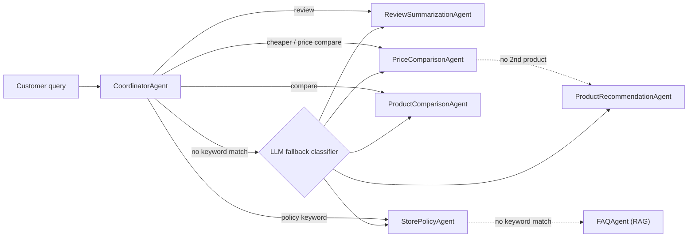

# Pickr AI

Online shopping tools tend to force a choice between generic, non-interactive product listings and a single chatbot trying to handle recommendations, comparisons, reviews, and policy questions all at once — with no specialization and no safeguards against making things up. Pickr AI's objective is to show that task-specialized AI agents, each grounded in the real catalog rather than a model's memory, can do meaningfully better. An AI shopping assistant that answers product, review, and store-policy questions — a coordinator routes each query to a specialized agent, rather than one do-everything prompt.

## Architecture



Guardrails (prompt-injection, off-topic, moderation, hallucination checks) wrap every routed call, and conversation history persists to a MySQL database so follow-ups resolve correctly. Routing itself is keyword-based and free; a query matching no keyword rule is classified by one small LLM call instead of defaulting blindly, so novel phrasing still lands on the right agent.

## Example queries

Real queries against the actual catalog, not fabricated examples:

| Ask | Routes to |
|---|---|
| "Recommend a laptop under $600" | `ProductRecommendationAgent` — filters in-stock laptops, explains the pick |
| "Compare Pro Book v60930 and Performance Pro v56156" | `ProductComparisonAgent` — feature + price comparison |
| "Which one's cheaper?" | `PriceComparisonAgent` — exact $ and % delta, no LLM call |
| "What are people saying about the Bass Boost v3811?" | `ReviewSummarizationAgent` — summarizes real reviews |
| "What's your return policy?" | `StorePolicyAgent`, falling back to a RAG search if nothing matches exactly |

## Run it

Requires Python 3.11+ and an [OpenAI API key](https://platform.openai.com/api-keys).

```bash
git clone https://github.com/Tegdam/pickr_ai.git
cd pickr_ai
python -m venv env
source env/bin/activate      # Windows: env\Scripts\activate
pip install -r requirements.txt
```

Create a `.env` file in the repo root with your key:

```
OPENAI_API_KEY=sk-...
```

Start the server:

```bash
python -m uvicorn app.main:app --reload
```

(Use `python -m uvicorn`, not bare `uvicorn` — on some setups `uvicorn` resolves to a stray install outside the venv and fails with `ModuleNotFoundError: No module named 'dotenv'`.)

Open **http://localhost:8000** and ask a question. `Ctrl+C` to stop.

Chat history (remembering earlier turns in a conversation) is optional — the app runs fine without it. To enable it, also add these to `.env`:

```
DB_HOST=<value>
DB_PORT=<value>
DB_NAME=<value>
DB_USER=<value>
DB_PASSWORD=<value>
```

LangSmith tracing (per-query observability — which agent handled a request, how many OpenAI calls it made, and how long each step took) is optional too. To enable it, also add these to `.env`:

```
LANGSMITH_TRACING=true
LANGSMITH_API_KEY=<value>
LANGSMITH_PROJECT=<value>
```

## Stack

- **API:** FastAPI + Uvicorn
- **LLM:** OpenAI (`gpt-3.5-turbo`, `text-embedding-3-small`), traced via LangSmith
- **Data:** pandas-cleaned CSV catalog (products/reviews/policies), cached in-process
- **RAG:** ChromaDB, for store-policy retrieval (`FAQAgent`)
- **Chat history:** SQLAlchemy + PyMySQL against AWS RDS
- **Evals:** `ragas` (faithfulness / relevancy) — see `evals/`
- **Tests:** `pytest`, OpenAI mocked (no live API key needed to run the suite)
- **Frontend:** static HTML/CSS/JS, no framework or build step

## Project layout

```
app/
  main.py             FastAPI entrypoint
  api.py              /api/query, /api/sessions routes
  conversation.py     chat history (MySQL) + query condensation
  agents.py           CoordinatorAgent + the 6 specialized agents
  guardrails.py       input/output safety checks
  db.py               CSV loading (cached)
  data_cleaning.py    CSV cleaning (dedupe, missing values, ranges)
  models.py           Pydantic models
static/index.html     frontend (single file, no build step)
data/                 products.csv, reviews.csv, store_policies.csv
tests/                pytest suite
evals/                ragas evals against live OpenAI
```

## Deployment

Deployed on [Hugging Face Spaces](https://huggingface.co/spaces) via the Docker SDK (port 7860) — see `Dockerfile`. Secrets (`OPENAI_API_KEY` and, optionally, the `DB_*`/`LANGSMITH_*` variables above) are set as Space secrets rather than baked into the image; `.dockerignore` keeps `.env` and the local virtual environment out of the build entirely.

**Try it live:** https://huggingface.co/spaces/TegFace/pickr-ai
