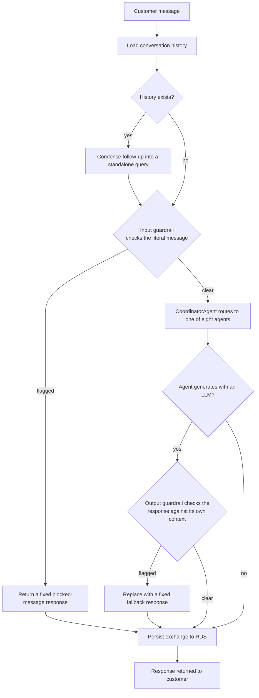
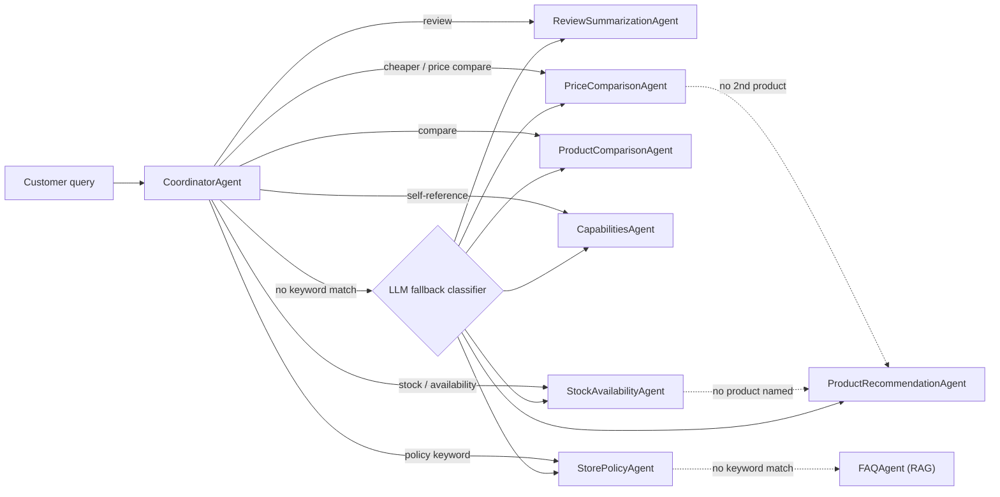

# Pickr AI — Project Documentation

## 1. Executive Summary

Pickr AI is a conversational shopping assistant that helps customers
navigate an e-commerce catalog through natural-language queries — asking
for product recommendations, comparing products, checking prices,
summarizing reviews, and getting store-policy answers, all through a single
conversational interface. The project originated from the course-provided
brief for an AI-driven multi-agent e-commerce assistant and was carried
through to a working, tested, deployed system under the name Pickr AI.

The project's objective was to demonstrate that a multi-agent AI
architecture, rather than a single general-purpose prompt, can deliver
task-specialized, more reliable e-commerce assistance: routing each query to
the agent best suited to answer it, retrieving grounded information rather
than relying purely on a model's memory, and safeguarding those answers
against unsafe or unsupported responses. This reflects a real and growing
trend in e-commerce, where platforms increasingly rely on AI for
personalization, product discovery, and customer support — the same shift
that motivated the original brief.

Pickr AI's approach combines a multi-agent large-language-model
architecture with retrieval-augmented generation, automated safety checks,
persistent conversation memory, and an automated evaluation and testing
pipeline. Each of these is detailed in the sections that follow.

The result is a working assistant that fulfills the brief's core objectives
— natural-language query handling, specialized agent delegation, product
recommendations, price and feature comparisons, review summarization, and
store-policy assistance — built, tested, and deployed as a live,
cloud-hosted application.

## 2. Solution Outline

**Core problem.** Online shoppers are typically served one of two poor
experiences: generic, non-interactive product listings with no way to ask a
follow-up question, or a single general-purpose chatbot prompt that has to
simultaneously handle recommendations, comparisons, review synthesis, and
policy questions with no specialization and no guardrails against making
things up. Customers also routinely face review overload — dozens or
hundreds of reviews per product with no quick way to extract the actual
verdict — and no easy way to compare specific products side by side on
price and features. Pickr AI addresses this by giving each of those tasks
to a dedicated agent behind one conversational interface, so a customer can
ask a natural-language question and get an answer produced by the agent
best equipped to produce it, grounded in the real catalog rather than
invented.

**Key features.**

- **Query routing.** A `CoordinatorAgent` classifies each incoming query
  and routes it to one of eight specialized agents, rather than handling
  every request with one general-purpose prompt.
- **Product recommendations.** Filters the catalog by category, brand, and
  price ceiling extracted from the query, then has the LLM select and
  explain a shortlist from the filtered results — the model recommends
  from a pre-filtered, real set of products rather than free-associating
  from the full catalog.
- **Product comparison.** Matches two or more named products from the
  query and produces a feature/price comparison grounded in their actual
  catalog listings.
- **Price comparison.** Computes exact dollar and percentage price
  differences between named products deterministically, without an LLM
  call, for cases that need a precise number rather than a narrative.
- **Review summarization.** Synthesizes a product's customer reviews into
  a concise summary of praise and complaints.
- **Store policy and FAQ.** Answers return, refund, warranty, and shipping
  questions via an exact-match policy lookup, falling back to a
  retrieval-augmented (RAG) search over the store policy set for questions
  that don't use the exact policy keywords. Because the catalog holds one
  policy row per product category (a separate return policy for laptops,
  smartphones, TVs, and speakers), a query naming a specific product is
  first resolved to that product's category, so a question about one SKU
  reaches the policy that actually governs it.
- **Stock availability.** Reports whether a named product is in stock and
  how many units remain, read directly from the catalog without an LLM
  call — a factual quantity with exactly one correct answer.
- **Assistant self-description.** Answers "what are you?" / "what can you
  do?" with a fixed description of the assistant's own scope, so a
  first-time user can discover what the system handles rather than being
  turned away by the off-topic guardrail.
- **Safety guardrails.** Every query is checked for prompt injection and
  off-topic intent before routing, and every LLM-generated answer is
  checked against the context it was given for hallucination before being
  returned to the customer, with OpenAI's Moderation API run on both ends.
- **Conversation memory.** Multi-turn conversations are persisted, and
  follow-up questions ("what about something cheaper?") are resolved
  against prior turns before being routed, so the specialized agents never
  need to know a conversation exists.
- **Observability and performance monitoring.** Every OpenAI call is traced
  through LangSmith, with all the calls made during a single query —
  condensation, guardrails, generation — grouped under one parent trace
  instead of appearing as disconnected entries. This gives per-query
  visibility into which agent ran, how many LLM calls it made, and the
  latency of each step, for monitoring and debugging live behavior.
  Separately, and independent of whether LangSmith tracing is even
  configured, `CoordinatorAgent` logs one structured line per query —
  which agent handled it, whether via a keyword match or the LLM fallback
  (§11), status, and latency — so routing behavior stays observable from
  plain server logs alone.
- **Evaluation harness.** Agent responses are scored against reference
  datasets built from the real catalog on correctness, faithfulness, and
  relevancy, run against live OpenAI calls rather than left as untested
  scaffolding.
- **Automated testing and delivery.** A `pytest` suite covering routing,
  agents, guardrails, and the API layer runs automatically in CI on every
  push, and the application is containerized and deployed as a live web
  app.

**Technologies and tools.**

| Category | Technology |
|---|---|
| LLM & embeddings | OpenAI (`gpt-3.5-turbo`, `text-embedding-3-small`) |
| LLM tracing/observability | LangSmith |
| Agent orchestration | Custom Python coordinator/agent classes |
| Backend API | FastAPI + Uvicorn |
| Data processing | pandas (catalog cleaning), in-process caching |
| Retrieval (RAG) | ChromaDB |
| Conversation persistence | SQLAlchemy + PyMySQL, AWS RDS (MySQL) |
| Evaluation | `ragas` (correctness, faithfulness, relevancy) |
| Testing | `pytest` |
| CI/CD | GitHub Actions |
| Containerization & deployment | Docker, Hugging Face Spaces |
| Frontend | Static HTML/CSS/JavaScript (no framework) |

## 3. Working Mechanism

**Life of one request.** A customer's message goes through the same
pipeline on every turn, whether it's the first message in a conversation or
a follow-up:

1. The frontend sends the message and a conversation id to `POST
   /api/query`. `handle_conversational_query` is the single orchestration
   function for the whole turn.
2. The last few turns of that conversation (if any) are loaded from RDS.
3. If there's prior history, one LLM call rewrites the message into a
   standalone question — e.g. "what about something cheaper" becomes "what's
   a cheaper alternative to the X" — so the rest of the pipeline never has
   to reason about conversational context. This step is skipped entirely on
   a conversation's first message.
4. The input guardrail checks the message for prompt injection, off-topic
   intent, and policy violations — against the customer's literal wording,
   not the rewritten version, so a rewrite can't inadvertently soften or
   obscure something the guardrail should catch. A flagged message never
   reaches an agent.
5. `CoordinatorAgent` routes the (rewritten) query to one of eight
   specialized agents by keyword priority. If the query names a specific
   catalog product, the coordinator also resolves it to that product's
   category at this point, so a policy question about a single SKU can be
   matched against the policy covering its category.
6. An LLM-generating agent builds its own grounded context — a filtered
   product shortlist, the specific products named in the query, a product's
   review text, or policy chunks retrieved via RAG — makes one OpenAI call,
   and passes its own response back through an output guardrail that checks
   it for hallucination against that same context before it's allowed to
   reach the customer. The four fully deterministic agents (exact-match
   store policy lookup, price-delta computation, stock lookup, and the
   assistant's own self-description) skip this step since there's no
   generated text to check.
7. The exchange (the customer's original message and the final answer) is
   persisted as one row pair, and returned to the customer.

Every OpenAI call made along this path — condensation, both guardrail
checks, and the agent's own generation call — is traced through LangSmith
under a single parent trace for the request, rather than appearing as
disconnected entries (see §2, Observability).

**Component breakdown.**

| Component | File | Responsibility |
|---|---|---|
| API entrypoint | `app/main.py` | Mounts the API router and the static frontend |
| HTTP layer | `app/api.py` | `/api/query`, `/api/sessions`; catches unhandled errors |
| Orchestration | `app/conversation.py` | History load/save, follow-up condensation, tracing |
| Coordinator + agents | `app/agents.py` | Routing and the eight specialized agents |
| Guardrails | `app/guardrails.py` | Input/output safety checks |
| Data loading | `app/db.py`, `app/data_cleaning.py` | Cached, cleaned CSV catalog access |
| Schema | `app/models.py` | Pydantic request/data models |
| Shared LLM client | `app/openai_client.py` | Traced OpenAI client instance |
| Frontend | `static/index.html` | Single-page chat UI |

The full agent-routing decision tree — which keyword sends a query to which
agent, the LLM fallback for queries that match no keyword, and the two
further fallback chains for a dead-end match — is shown as the high-level
architecture diagram in §11.

## 4. Data Requirements

Pickr AI doesn't train, fine-tune, or validate a machine learning model of
its own — all natural-language understanding and generation runs through
OpenAI's hosted models via API. Rather than a model training/validation/test
split, the data requirement is a catalog to reason over at inference time,
plus a held-out set of reference queries used to score the quality of agent
responses — the closest equivalent to a validation set in this project.

**Types of data.**

| Dataset | Rows | Fields | Used by |
|---|---|---|---|
| `products.csv` | 2,000 | id, name, brand, category, price, description, stock, rating | Product recommendation, comparison, price comparison |
| `reviews.csv` | 4,000 | product_id, rating, text, date | Review summarization |
| `store_policies.csv` | 22 | policy_type, description, conditions, timeframe | Store policy lookup, FAQ (RAG) |

Beyond the catalog itself, three evaluation datasets
(`evals/data/recommendation_evals.json`, `comparison_evals.json`,
`store_policies_evals.json`) hold reference query/answer pairs used to score
agent responses on correctness, faithfulness, and relevancy. These were
built by the author querying the live catalog for real shortlists and
matches — not fabricated — since the reference answer for a query like "recommend
a laptop under $600" has to reflect what's actually in `products.csv`.

**Data source.** All three catalog datasets were provided as part of the
course's project materials, not scraped or assembled independently. They
were treated as fixed, external data throughout development — a constraint
that shaped several decisions elsewhere in this project (e.g. the CSVs
themselves are never modified; a placeholder UI example that referenced a
non-existent product was corrected to reference a real one rather than the
other way around).

**Preprocessing and cleaning.** Each dataset is loaded into a pandas
DataFrame and cleaned before use: duplicate rows are dropped (by full row,
and by `id` for products specifically), rows missing an essential field are
dropped (a whitespace-only field counts as missing), numeric fields are
clipped to valid ranges (price > 0, stock ≥ 0, rating in [0, 5]), and review
dates that don't parse are dropped. In practice the provided CSVs were
already clean end to end — row counts were identical before and after
cleaning — so this logic was verified separately against synthetic dirty
rows (duplicate ids, blank fields, negative prices, out-of-range ratings,
malformed dates) rather than against a visible effect on the real data. It
stays in place as a correctness guarantee for the data as provided, and for
anyone hand-editing the CSVs afterward. Cleaned data is cached in memory for
the life of the process, so this cleaning cost is paid once rather than on
every request.

## 5. Limitations

**Data and model constraints.** The catalog is fixed and course-provided —
there's no live pricing/stock feed, and no record of individual customer
behavior or purchase history. As a direct consequence, product
recommendations are catalog-filter-based (category, brand, price ceiling
parsed from the query) rather than personalized to a specific returning
customer — there's no behavioral data in the dataset to personalize
against. Within recommendation matching itself, category detection requires
a query to use the catalog's own category spelling, so unusual phrasing can
miss a match; and a keyword-routing fallback for comparison-style follow-ups
("what about something cheaper") doesn't currently carry over a specific
price ceiling mentioned earlier in the conversation, so it can occasionally
resurface a similar product rather than a strictly cheaper one. Running the
evaluation harness surfaced a real, measured gap as well:
`ProductRecommendationAgent` scores lower on faithfulness (0.41 average)
than `ProductComparisonAgent` (1.00) — it tends to elaborate with
interpretive phrasing that the metric doesn't count as directly supported by
its context, even where it isn't a fabrication. Separately, the store-policy
retrieval index rebuilds in full on any change rather than incrementally,
which is fine at the current policy set's size but would need revisiting if
that set grew substantially; and the in-process catalog cache means a CSV
edited on disk has no effect until the process restarts.

**External dependencies and risk mitigation.** Every LLM-generating agent
depends on OpenAI's API being reachable; an outage or rate-limiting there
degrades most of the assistant's functionality, though the four fully
deterministic agents (exact-match policy lookup, price-delta computation,
stock lookup, and the assistant's own self-description) keep working
regardless — a slightly wider floor of still-useful behavior during an
outage than before those agents existed. This is mitigated by automatic retries on
transient failures, but a sustained outage is still a hard dependency, not
something the system can route around. The safety guardrails and the
conversation-history database are both deliberately designed to fail open
rather than fail closed on their own infrastructure errors — a broken
classifier call or an unreachable database degrades a request (no
guardrail re-check on that one call; no history for that one turn) instead
of failing it outright — which trades a small amount of strictness for
availability. The application currently runs as a single containerized
process without a multi-worker or horizontal-scaling story, which would
need addressing under concurrent load beyond what one instance can handle.

**Guardrail coverage is probabilistic, not a guarantee.** The output
faithfulness check is itself an LLM classifier, and reviewing real
conversation history produced a confirmed miss: a fabricated stock figure
("7" against a true value of 173) passed the check and reached the
customer (§6). This is the honest limit of the design — a classifier
reduces the rate of unsupported answers but cannot bound it, and it is
weakest exactly where a fabrication is a single plausible-looking number
rather than an obviously invented claim. The response was not to tune the
classifier and call it fixed, but to remove the opportunity: factual
lookups with one correct answer (stock counts, price deltas, exact policy
text) are now handled by deterministic agents that make no LLM call at
all, so for those questions there is nothing to hallucinate rather than a
safety net hoping to catch it. That reasoning does not extend to the
genuinely generative agents — recommendation, comparison, and review
summarization still depend on the classifier, and the measured
faithfulness gap noted above is the residual risk there.

**Ethical and data-handling considerations.** Every LLM-generated response
passes through an automated safety check before reaching a customer:
OpenAI's Moderation API on both the incoming query and the generated
answer, plus a dedicated classifier for prompt injection, off-topic
requests, and unsupported or hallucinated claims. Conversation history is
transmitted to and stored in AWS RDS over a TLS connection with certificate
and hostname verification, protecting it in transit. A customer's
conversation history can be deleted on request — unlike the read/write
paths elsewhere in the system, deletion deliberately does not fail open,
since silently doing nothing in response to an explicit deletion request
would be worse than surfacing the error. What's still open is automatic,
time-based retention: there's no scheduled expiry today, so a conversation
is kept indefinitely unless a customer (or an operator, on their behalf)
explicitly requests its deletion. Whether to add automatic expiry, and
what window, remains a decision for before this handled real customer data
under a formal privacy obligation.

## 6. Feasibility Study

**Technical feasibility.** Every building block Pickr AI relies on —
a hosted LLM API, a REST framework, a vector database, a relational
database — is mature, off-the-shelf technology; the project's technical
risk was in integration and correctness, not in unproven methods. That risk
played out as expected: the working, tested, deployed system is itself the
feasibility result. Formal load/throughput benchmarking of the deployment
was scoped as a separate follow-on study (noted briefly as future work in
§12) and wasn't run as part of this project, so scalability below is
assessed by design, not by measurement.

**Challenges encountered and how they were resolved.**

- **A real, in-production correctness bug in the safety guardrail.**
  Customers occasionally received a generic fallback message on queries
  that should have worked. Investigation using real conversation history
  (not synthetic test cases) traced it to the hallucination classifier:
  its own prompt stated that an honest "I don't have that information" is
  not a hallucination, but the classifier wasn't reliably honoring that
  exception. Fixed by adding concrete few-shot examples built from the
  actual observed failures, verified against both the previously-blocked
  honest responses and genuine fabrications to confirm the fix didn't
  weaken real detection.
- **Retrieval going stale under in-place edits.** The FAQ agent's RAG index
  originally rebuilt only when the number of store policies changed, which
  missed an existing policy being edited in place — a changed return window
  would keep citing the old terms indefinitely. Fixed by hashing the
  content of every policy row and rebuilding whenever that hash changes,
  covered by a test that asserts the embedding call count directly across
  an unchanged rebuild versus an edited one.
- **A caching question resolved by finding the real bottleneck.** Before
  adding catalog caching, the question was whether cleaning the CSVs at
  load time (rather than as a separate offline preprocessing step) would
  scale as the catalog grew. It turned out the actual cost driver was
  elsewhere: every agent reloads the catalog in its own constructor, and a
  new agent instance is created on every request — so the catalog was being
  re-read, re-parsed, and re-cleaned on every single query regardless of
  how the cleaning itself was structured. In-process caching (one load per
  process, not per request) fixed the actual bottleneck directly, which
  left the original load-time-cleaning approach fully fine to keep.
- **A guardrail wired to check the wrong text.** While re-tracing the
  request pipeline to describe it accurately for this document, the
  input-safety guardrail turned out to be checking an LLM-condensed
  version of follow-up questions instead of what the customer actually
  typed — the opposite of its intended design. Caught by documentation
  work, not a failing test, and fixed the same day (§3 describes the
  corrected flow). A reminder that accurate documentation is itself a way
  of surfacing real bugs, not just recording them after the fact.
- **A fabricated stock count, and the coverage gap behind it.** Reviewing a
  real stored conversation surfaced the most serious correctness failure
  found in this project: asked how many units of a product were in stock,
  the assistant confidently answered "7" when the catalog said 173. The
  cause was structural rather than a bad prompt. No agent owned
  stock questions, so the query fell through to
  `ProductRecommendationAgent`, whose context lines carry brand, category,
  price, rating, and description — but not `stock`. The model was asked a
  quantitative question about a number it had never been shown, and
  supplied one. The output guardrail, which exists precisely to catch
  unsupported claims, did not flag it. The fix treats the root cause on
  both counts: a dedicated `StockAvailabilityAgent` answers these
  deterministically from `products.csv`, so there is no generation step in
  which a number can be invented. The broader lesson — that an unanswerable
  question routed to a plausible-looking agent is more dangerous than one
  that dead-ends, because the fallback produces a confident answer rather
  than an error — also motivated auditing which other question types had no
  owner.
- **Product-specific policy questions that quietly failed.** The same
  conversation showed the assistant unable to answer "what is the return
  policy for Maxi Phone v54822?" despite that policy existing, while the
  category-level phrasing ("return policy for smartphones") worked
  correctly. Two independent defects overlapped. Nothing in the pipeline
  connected a product name to its category, so neither the keyword lookup
  nor the RAG search could reach a policy whose text never mentions the
  SKU; and `StorePolicyAgent`'s keyword match compared the query against
  policy types word by word, so the catalog's plural `returns` never
  matched a customer's singular "return" — meaning even category-level
  questions were silently falling through to the RAG fallback rather than
  matching directly. Both are now fixed and covered by tests, including a
  regression test that a multi-word type like `price_matching` does not
  match on the word "price" alone.
- **A first-time user being turned away at the door.** The transcript
  opened with "what are you?" and "what can you do?", both of which the
  off-topic guardrail rejected — a reasonable classification in the
  narrowest reading of its instructions, and clearly the wrong product
  behavior for the first two questions a new user asks. The guardrail's
  scope now treats the assistant's own capabilities as on-topic, and a
  `CapabilitiesAgent` answers with a fixed description of what the system
  handles. Worth recording because it wasn't a bug in the usual sense:
  every component behaved as specified, and the specification was what was
  wrong.

**Scalability.** The in-process catalog cache and the content-hash-gated
RAG index both exist specifically so repeated work isn't repeated: the
catalog is read and cleaned once per process rather than once per request,
and the policy index is only re-embedded when its content actually changes.
Each request instantiates its own agent objects but shares the same
underlying cached, immutable catalog data, so there's no per-request shared
mutable state to contend over. That said, the deployment today runs as a
single container process with no multi-worker or horizontal-scaling
configuration — a real next step for handling concurrent load beyond a
single instance, not yet exercised.

**Reliability.** The OpenAI client retries transient failures automatically
before giving up. Both the safety guardrails and the conversation-history
database are designed to fail open on their own infrastructure errors
rather than take the whole request down with them. Unhandled errors return
a fixed, generic message to the customer while the real exception is
logged server-side, so failures are diagnosable without leaking internals.
A 121-test automated suite covering routing, agents, guardrails, and the API
layer runs in CI on every push, catching regressions before they reach
`main`.

**Security.** Every query and every generated response passes through
OpenAI's Moderation API plus a dedicated classifier for prompt injection,
off-topic requests, and hallucinated claims, before either ever reaches the
customer or an agent. The RDS connection is encrypted and verifies both the
server's certificate and its hostname, rather than trusting an encrypted
but unauthenticated connection. The container build excludes `.env` and the
local virtual environment via `.dockerignore`, so secrets are supplied at
runtime rather than baked into the image.

## 7. Dependencies

**Infrastructure requirements.** The application runs as a single Docker
container (`python:3.11-slim`) deployed to Hugging Face Spaces. Chat
history is backed by an AWS RDS MySQL instance — the only other piece of
provisioned infrastructure the system depends on, and even that dependency
is optional: the app runs and answers queries with it entirely absent,
degrading to "no conversation memory" rather than failing. No GPU or other
dedicated ML compute is required anywhere in the stack — all language
understanding and generation runs through OpenAI's hosted API rather than a
locally hosted or fine-tuned model.

**Software frameworks, libraries, and tools.**

| Category | Dependency |
|---|---|
| Web framework | FastAPI, Uvicorn |
| Data validation | Pydantic |
| LLM / embeddings client | `openai` |
| Tracing | `langsmith` |
| Data processing | pandas |
| Relational persistence | SQLAlchemy, PyMySQL |
| Vector store (RAG) | ChromaDB |
| Evaluation | `ragas` (with `langchain_openai` / `langchain-community` as its own dependencies) |
| Testing | `pytest` |
| Configuration | `python-dotenv` |

This list was deliberately trimmed rather than left to grow: `motor` (an
async MongoDB driver), `streamlit`, and a bare `langchain` import were
removed after confirming via a repo-wide search that none were actually
imported anywhere — leftovers from an earlier direction that was never
built, not dependencies the running system needs.

**External integrations.** OpenAI's API is the one integration the system
cannot function without — chat completions, embeddings, and the Moderation
endpoint are all called through it. LangSmith is an optional tracing
backend: calls are wrapped unconditionally, but tracing is a genuine no-op
until tracing credentials are configured, so no LangSmith account is needed
for the application itself to work. AWS RDS is the optional chat-history
backend described above. GitHub Actions runs the test suite on every push
as part of the delivery pipeline, and Hugging Face Spaces is the deployment
target the container is built for.

## 8. Project Planning

**Timeline and milestones.** Development ran for about two weeks —
condensed from the eight-week schedule in the original course plan, but
covering the same broad progression: core agents and evaluation first,
then the API and frontend, then observability and safety, then data
quality and reliability hardening, then documentation and deployment prep.
There was no multi-person team on this project, so work wasn't divided by
role — one contributor carried design, implementation, testing, and
documentation through each phase below.

| Day | Milestone |
|---|---|
| Day 1–2 | Core agents implemented; first evaluation dataset and correctness fixes |
| Day 5 | FastAPI wrapper, frontend, test suite, and Dockerfile added |
| Day 6–7 | Renamed to Pickr AI; routing/faithfulness eval coverage, structured logging and LangSmith tracing, input/output safety guardrails, RDS-backed chat history |
| Day 11 | RDS connection hardened with TLS and certificate/hostname verification |
| Day 13 | UI overhaul (sessions sidebar, receipt-styled frontend); CSV cleaning and in-process caching; guardrail false-positive fix; dependency cleanup, DRY refactor, CI workflow, retry/error-handling hardening, and extended eval coverage |
| Day 14 | Per-query LangSmith tracing; this documentation pass, which surfaced and fixed a real guardrail-ordering bug (§3, §6) |
| Day 15 | Deployed to Hugging Face Spaces via a gated CI workflow; session deletion added to the sidebar |
| Day 16 | UI refinements (bottom-anchored query input, status indicator); post-deployment transcript review added the stock-availability and capabilities agents, product-to-category policy resolution, and the policy keyword-matching fix (§6), growing the suite to 121 tests |

**Roadmap followed.** Development and testing were never separate phases —
every agent and feature was accompanied by tests as it was built, so the
suite grew alongside the system rather than being written retroactively at
the end. A CI workflow was added partway through to enforce that
automatically on every push going forward, rather than relying on running
tests locally before each commit. Deployment was prepared throughout rather
than left to the end: the Dockerfile and `.dockerignore` were added early
(Day 5), well before the features that would eventually run inside that
container were finished, so the deployment target stayed a continuous
constraint rather than a last-minute integration step.

## 9. Cost Optimization

**Estimated infrastructure and compute costs.** No paid infrastructure tier
is required to run Pickr AI. The recurring costs are usage-based, driven by
what's actually called:

| Item | Price | Source |
|---|---|---|
| `gpt-3.5-turbo` | $0.50 / 1M input tokens, $1.50 / 1M output tokens | According to OpenAI's pricing page |
| `text-embedding-3-small` | $0.02 / 1M tokens | According to OpenAI's pricing page |
| OpenAI Moderation endpoint | Free | According to OpenAI's pricing page |
| Hugging Face Spaces, CPU Basic (2 vCPU / 16 GB) | Free | According to Hugging Face's pricing page |
| Hugging Face Spaces, CPU Upgrade (8 vCPU / 32 GB) | $0.03/hour (~$21.60/month continuous) | According to Hugging Face's pricing page |
| AWS RDS MySQL, `db.t3.micro`, Single-AZ, on-demand | ~$0.018/hour (~$13/month continuous) | According to AWS RDS instance pricing trackers |
| AWS RDS Free Tier | 750 hours/month Single-AZ + 20 GB storage + 20 GB backup, free for 12 months on a new account | According to AWS's RDS for MySQL pricing page |

As a rough, illustrative estimate (not measured against real usage logs,
since none exist yet): a single LLM-routed query — input guardrail check,
generation, output guardrail check, each a small prompt plus a short
response — works out to roughly 1,000–1,500 tokens total across those
calls. At `gpt-3.5-turbo`'s published rate, that's on the order of
$0.001–0.0015 per query, a tenth of a cent or less. The two Moderation
calls in that same request add nothing, since that endpoint is free. The
LLM routing fallback (§11) adds one more small, cheap call, but only for
the minority of queries that match no keyword rule — everything else,
including the four fully deterministic agents, is unaffected. Two of those
four were added specifically to move common question types (stock counts,
"what can you do?") off the LLM path entirely, so they now cost nothing
per query as well as being immune to fabrication.

**Cost-saving strategies.** Every framework and library in the stack is
open-source with no licensing fee — FastAPI, ChromaDB, `ragas`, `pytest`,
SQLAlchemy — so the only real spend is usage-based API and hosting cost,
not software licensing. The application has no GPU or dedicated ML compute
requirement (§7), so it fits the free CPU-Basic Spaces tier rather than a
paid upgrade. The content-hash-gated RAG index avoids re-embedding the
store-policy set on every process restart, only paying the (already small,
at 22 rows) embedding cost when policy content actually changes. Chat
history's RDS usage at this project's scale sits well within AWS's Free
Tier allowance. Dependency cleanup (§7) also keeps the container image
smaller and faster to build, which isn't a direct dollar line item at this
scale but is the same discipline that would matter at a larger one.

**Cost/performance trade-offs.** The guardrail design (§5, §6) deliberately
turned one OpenAI call per query into up to five, prioritizing safety and
correctness over raw cost — a trade-off made explicitly, not by default,
and one that's inexpensive to sustain given how cheap `gpt-3.5-turbo` is
per call. Model choice is itself a cost/performance trade-off: `gpt-3.5-turbo`
was used throughout rather than a more expensive, more capable model,
since the agents' tasks — recommending from an already-filtered shortlist,
comparing named products, summarizing supplied review text — are
grounded, constrained generation rather than open-ended reasoning, which a
lighter model handles well at a fraction of the cost.

## 10. Use Cases

**Real-world applications.** These are real queries against the live
catalog, not illustrative fabrications — the first three are taken directly
from the evaluation datasets (§4); the last two are built the same way, by
querying the real catalog rather than inventing example data.

| Customer query | What Pickr AI does |
|---|---|
| "Recommend a laptop" | Filters to in-stock laptops, surfaces the current top-rated matches (e.g. Pro Book v60930, $1,121.82, 5.0/5; Performance Pro v56156, $399.08, 5.0/5), and explains why each fits |
| "Compare Pro Book v60930 and Performance Pro v56156" | Both are 5.0/5 UltraComp laptops; the Performance Pro v56156 is significantly cheaper, the Pro Book v60930 offers longer battery life |
| "What's your policy for sending back a laptop I'm not happy with?" | Returns the 14-day laptop return policy — unopened or like-new, original accessories and packaging, return label requested via the online account |
| "What's the price difference between the Pro Book v60930 and the Performance Pro v56156?" | Computes it directly: $722.74 cheaper (64.4% less), no LLM call needed |
| "What are people saying about the Bass Boost v3811?" | Summarizes its 9 reviews — consistently positive on sound quality, portability, and battery life |
| "How many SmartView TV v3881 do you have in stock?" | Reads the real figure from the catalog — 173 available — with no LLM call, so the number cannot be invented |
| "What's the return policy for Maxi Phone v54822?" | Resolves the SKU to `smartphone` and returns that category's 14-day policy: no cracks or water damage, factory reset, original charger and box |

**Industries and businesses that could benefit.** The most direct fit is
any online retailer or e-commerce platform looking to deflect repetitive
product-discovery, comparison, and policy questions away from human
support — the same problem space the original course brief identified.
Smaller retail businesses without the engineering resources to build this
from scratch could use the same pattern to automate their own catalog and
policy assistance. The architecture itself — a coordinator routing to
task-specialized, guardrailed agents over a fixed dataset — isn't specific
to e-commerce and would carry over to any customer-facing domain with a
structured catalog and a policy set: subscription services, equipment
rental, or internal IT/HR helpdesks answering policy questions over a
fixed knowledge base.

**Possible extensions.** Three natural next steps — behavior-based
personalization, a cart/checkout agent, and price-drop alerts — turn out to
share one root blocker rather than being three independent gaps: all three
need to know who is asking *across visits*, and Pickr AI has no customer
identity to hang that on. `conversationId` is a random UUID generated fresh
per page load, not tied to a login or any persistent customer record, and
none of the provided data identifies an individual customer either (not
even `reviews.csv`, which has no reviewer id). A real identity layer —
accounts, or even just a persistent anonymous identifier — is the actual
prerequisite for all three, not a bigger agent roster or a new CSV on its
own. Price-drop alerts would additionally need a scheduler, which the app
has none of today. Query routing itself was already revisited during this
project rather than left as a future item — see §11 — with a narrow LLM
fallback added for queries that match no keyword rule. Separately, and
without that identity blocker, the agent roster could still grow toward
integration with a real, live product catalog API rather than a static
CSV, which the existing coordinator/guardrail architecture would absorb
without change.

## 11. High-Level Solution Diagram

This is the routing-decision view of the architecture — which agent
handles a given query, and the fallback chains that catch a near-miss
rather than dead-ending. It complements the temporal, request-lifecycle
diagram in §3, which shows history, condensation, and the guardrails
wrapped around this same routing step.

`CoordinatorAgent` checks a fixed priority order — review, then price
comparison, then general comparison, then self-reference, then stock, then
store policy — because several of these would otherwise overlap on the
same query (a query like "compare the price of X and Y" contains both
"compare" and "price"). A query matching none of those keyword rules no
longer defaults blindly to product recommendation: one small LLM call
classifies it into the same seven categories instead, so unanticipated
phrasing still reaches the right agent. This fallback is deliberately
narrow — it only runs on that no-match minority, so every keyword-matched
query, including the four fully deterministic agents, still costs nothing
extra. Three further branches fall through rather than dead-ending,
regardless of how they were reached: `PriceComparisonAgent` hands off to
`ProductRecommendationAgent` when a query doesn't name two products to
compare (e.g. a relative request like "something cheaper" rather than a
head-to-head comparison), `StockAvailabilityAgent` hands off the same way
when a query asks about stock generally without naming a product ("what do
you have in stock?"), and `StorePolicyAgent`'s exact-keyword match falls
back to `FAQAgent`'s retrieval-augmented search when a policy question is
phrased without the literal policy keyword.

Two pieces of query preprocessing sit alongside this routing. First,
policy-type matching compares against the whole policy-type phrase and its
singular/plural counterpart, rather than word by word: the catalog stores
`returns` while customers write "return policy", and a word-by-word match
on a multi-word type like `price_matching` would otherwise fire on any
query merely containing "price". Second, when a query names a specific
catalog product, the coordinator attaches that product's category before
handing off, which is what lets a question about "Maxi Phone v54822" reach
the smartphone return policy — neither the keyword lookup nor the RAG
search can connect a SKU to its category on its own, since the SKU appears
nowhere in the policy text.

## 12. Conclusion

Pickr AI set out to demonstrate that a multi-agent architecture could
deliver task-specialized, grounded e-commerce assistance in place of a
single general-purpose prompt, and it does: eight specialized agents behind
one coordinator, each producing answers grounded in the real catalog rather
than the model's own memory, protected end to end by input and output
safety guardrails, with multi-turn conversation memory, an automated
evaluation harness scored against live OpenAI calls, and a CI-tested,
containerized, deployed application. That covers the original brief's core
objectives in full; where the implementation departed from the brief's
specific technology suggestions — a static frontend instead of a
multi-window dashboard, a hand-rolled coordinator instead of a
third-party orchestration library — it did so within the latitude the
brief itself grants, not by cutting scope.

**Lessons learned.** The most consistent pattern across this project's
problems was that the real cause was rarely the first suspect. A pattern
of generic fallback responses looked at first like a routing problem; it
was actually a guardrail classifier not honoring its own stated exception,
found only by tracing real conversation history rather than synthetic test
cases. A question about whether catalog cleaning would scale as data grew
turned out to have nothing to do with cleaning at all — the real cost was
re-loading the catalog on every request, invisible until the caching
question forced a closer look. And most recently, writing this document
accurately — re-tracing the request pipeline rather than repeating what
earlier notes claimed it did — surfaced a real, live bug in the input
guardrail that no test had caught. Documentation and debugging turned out
to be the same activity more often than expected.

Reading a full stored conversation end to end, rather than testing
individual queries in isolation, was the single most productive debugging
technique of the project — it surfaced four distinct defects in one pass
(§6), including the fabricated stock count that was the most serious
correctness failure found. Those defects shared a root cause worth stating
plainly: the routing table had no concept of a question it could not
answer. Every query resolved to some agent, and the default was an agent
that generates prose, so an unowned question produced a confident,
fluent, wrong answer instead of an error. That failure mode is
specific to the fallback being generative — a system that dead-ends on an
unrecognized query is merely unhelpful, while this one was actively
misleading, and only a human reading the transcript would notice the
difference. It also reframed what the guardrails are for: a
classifier is a net for a generation step that shouldn't have been reached,
and removing the generation step where a question has one factual answer
is the stronger fix (§5).

A handful of earlier
decisions were also revisited rather than treated as settled once made —
the FAQ agent moved from a "just pass the full context" plan to real RAG,
its staleness check moved from counting rows to hashing content, and
keyword-based routing's documented limitation (phrasing the fixed rules
didn't anticipate) made a real case for LLM-based routing — but the
tradeoff was a genuine one, not a free upgrade: a full LLM router would
have added cost and latency to every query, including the ones that cost
nothing today, plus real regression risk against an already-tested routing
suite. The resolution scoped the fix to the actual problem rather than
reaching for the largest available solution: an LLM classifier that only
runs on the minority of queries no keyword rule catches, leaving the
tested, free, deterministic path untouched.

**Future developments.** The most concrete next step, detailed in §10, is
adding a customer identity layer — accounts, or even just a persistent
anonymous identifier in place of the current per-page-load random UUID.
That one piece of infrastructure is the shared prerequisite behind three
separate feature ideas (personalization, a cart/checkout agent, and
price-drop alerts), rather than each being its own isolated gap. Whether
the narrow LLM routing fallback (§11) needs to grow further is, by
contrast, already something to observe rather than guess at — its
`via=llm_fallback` log field makes how often it actually fires directly
measurable once live traffic exists. Beyond the application itself, a
separate performance
benchmarking study — profiling inference-serving behavior (e.g. vLLM vs.
SGLang, speculative decoding) under Pickr AI's own real, mixed workload of
interactive chat and bulk review summarization — was scoped as a follow-on
project but not executed as part of this one; it remains a distinct future
direction rather than something this report's results speak to.
